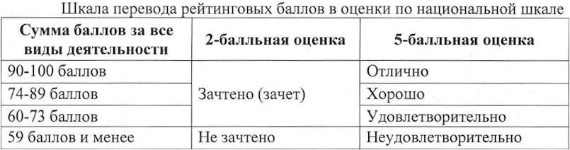
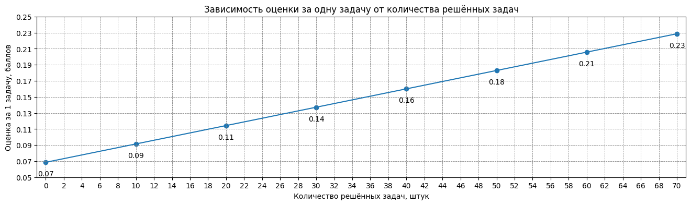
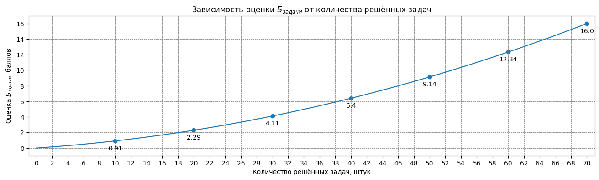

# Экзамен и оценивание

Результаты освоения дисциплины оцениваются в соответствии с: [Приказ № 964 от 31.08.2023 “Об утверждении Порядка применения балльно-рейтинговой системы оценивания успеваемости обучающихся по основным профессиональным образовательным программам высшего образования в ФГАОУ ВО “КФУ им. В.И. Вернадского”](https://cfuv.ru/wp-content/uploads/2023/11/Приказ-№-964-от-31.08.2023.pdf).

Оценка за дисциплину определяется как сумма баллов:

- за выполнение заданий в семестре $Б_{сем} \in [0..50]$;
- за мероприятие промежуточной аттестации (экзамен) $Б_{экз} \in [0..50]$;

Максимально возможная оценка за дисциплину $Б_{итог} \in [0..100]$.

Если за работу в семестре набрано менее 30 баллов, то за дисциплину выставляется оценка "неудовлетворительно" независимо от оценки полученной на экзамене и суммы баллов по 100 бальной шкале.

Если за экзамен набрано менее 30 баллов, то за дисциплину выставляется оценка "неудовлетворительно" независимо от оценки полученной в семестре и суммы баллов по 100 бальной шкале.

Оценки за работу в семестре и за экзамен получаются независимо друг от друга и пересдаются тоже отдельно.

Если за работу в семестре и за экзамен получены оценки $\geq$ 30, то по дисциплине выставляется оценка определяемая по шкале перевода:

 

## Работа в семестре

Оценка за работу в семестре определяется как сумма баллов:

- за контрольные тестирования (тесты) $Б_{тесты} \in [0..16]$;
- за индивидуальные практические задания (задачи) $Б_{задачи} \in [0..16]$;
- за групповые практические задания (проекты) $Б_{проекты} \in [0..18]$.

### Тесты

Каждый тест оценивается отдельно по 100-балльной шкале и вносит одинаковый вклад в оценку за этот вид деятельности:

$$Б_{тесты} = 16 \cdot \frac{1}{6} \sum_{i=1}^{6}\frac{тест_i}{100}$$

### Задачи

Индивидуальные практические задания оцениваются с применением прогрессивной шкалы, т.е. чем больше решено задач, тем больше баллов начисляется за каждую из них. Оценка за одну задачу при этом возрастает в соответствии с арифметической прогрессией:

$$C_n = C_0+d\cdot n = 0.0685714508914355 + 0.002285713966857044 \cdot n$$

Оценка за $n$ решённых задач:

$$Б_{задачи} = n \cdot C_n = 0.0685714508914355 \cdot n + 0.002285713966857044 \cdot n^2$$

### Проекты

Каждый проект оценивается отдельно по 100 балльной шкале и вносит вклад в оценку за этот вид деятельности в соответствии с формулой: 

$$Б_{проекты} = 12 \cdot \frac{проект_1}{100} + 6 \cdot \frac{проект_2}{100}$$

 

## Экзамен

Экзамен состоит из 2х последовательных этапов:

- экзаменационное тестирование $Б_{экз.тест} \in [0..100]$. Тестирование проверяет полноту знаний по дисциплине;
- ответ на экзаменационный билет $Б_{экз.билет} \in [0..100]$. Ответ на билет проверяет глубину знаний по дисциплине.

Итоговая оценка за экзамен определяется по формуле:

$$Б_{экз}=50 \cdot \frac{Б_{экз.тест}}{100}\cdot \frac{Б_{экз.билет}}{100}$$

### Экзаменационное тестирование

Тестирование состоит из 100 вопросов по 1 баллу за каждый вопрос. На тестирование отводится 1 час 30 минут. Пробный [тест для подготовки](https://moodle.cfuv.ru/mod/quiz/view.php?id=652467).

Т.к. $Б_{экз}$ должна быть $\geq$ 30, то минимально допустимая оценка за тест составляет 59 баллов. Если за тестирование было менее 59 баллов, то за экзамен выставляется $50 \cdot \frac{Б_{экз.тест}}{100}$ баллов без ответа на билет, а за дисциплину выставляется оценка "неудовлетворительно". Баллы по 100-бальной шкале определяются как было указано ранее.

### Ответ на билет

Билет состоит из 3х заданий направленных на:

- проверку умения решать задачи;
- проверку теоретических знаний (2 вопроса).

Каждое задание оценивается отдельно от 0 до 100 баллов. Итоговая оценка за ответ на билет определяется по формуле:

$$Б_{экз.билет} = 0.5 \cdot Б_{экз.задача} + 0.25 \cdot Б_{экз.вопрос1} + 0.25 \cdot Б_{экз.вопрос2}$$

### Экзаменационная задача

Экзаменационная задача выбирается обучающимся случайным образом из набора экзаменационных задач и на её решение отводится 45 минут. Задачи решаются в системе Яндекс.Контест и оцениваются от 0 до 100 баллов пропорционально количеству тестов пройденных решением.

Если, после решения задачи, значение $50 \cdot \frac{Б_{экз.тест}}{100}\cdot \frac{(0.5 \cdot Б_{экз.задача} + 50)}{100} \lt 30$, то за экзамен выставляется $50 \cdot \frac{Б_{экз.тест}}{100}\cdot \frac{(0.5 \cdot Б_{экз.задача} + 50)}{100}$ баллов без ответа на теоретические вопросы, а за дисциплину выставляется оценка "неудовлетворительно". Баллы по 100 бальной шкале определяются как было указано ранее.

### Теория

Вопросы по теории выбираются обучающимся случайным образом во время выбора билета (в одном билете сразу 2 вопроса). Полный список теоретических вопросов доступен [здесь](./exam_questions.md).

На подготовку к ответу обучающийся может потратить до 30 минут. Во время подготовки разрешено пользоваться чистым листом бумаги (выдаётся по просьбе) которым можно будет пользоваться во время ответа.

Ответы на вопросы даются в устном виде, максимально развёрнуто и подробно. Преподавателем могут быть заданы дополнительные уточняющие вопросы в контексте темы вопроса на который отвечает обучающийся.

Ответ на каждый вопрос оценивается от 0 до 100 баллов.

 

## Организационные вопросы

Обучающийся должен явиться на экзамен в день указанный в [расписании промежуточной аттестации](https://schedule-cloud.cfuv.ru/index.php/s/B7FDMNZ4NYdi2NJ) (даже, если вы набрали меньше 30 баллов за семестр). Неявка на экзамен сопровождается соответствующей записью в ведомости и дисциплина считается академическим долгом. В случае неявки по уважительной причине, нужно в кратчайшие сроки обратиться в учебно-организационный отдел (321А) с подтверждающими документами и заявлением на продление сессии (подробности в 321А).

Одновременно проходят экзамен столько обучающихся, сколько доступно рабочих мест в кабинете (5-10 человек). Остальные ожидают за дверью и заходят после того, как освобождается рабочее место.

При входе в кабинет обучающийся передаёт зачётку преподавателю и получает её обратно после окончания процедуры экзаменационного оценивания.

Во время экзамена запрещено иметь при себе любые личные вещи, кроме ручки/карандаша. Всё лишнее нужно будет положить в рюкзак и оставить в углу кабинета или отдать на хранение одногруппникам ожидающим за дверью.

На экзамене запрещено использовать любые дополнительные источники информации. Попытка ими воспользоваться (даже случайно) приравнивается к списыванию ответа, и за соответствующее задание (тест, задачу, вопрос) выставляется 0 баллов без проверки.

1. Сначала все по очереди проходят тестирование. Те кто НЕ набрал достаточное количество баллов получают обратно зачётки, оценку "неудовлетворительно" в ведомость и отправляются готовиться к пересдаче. Остальные ожидают, пока этап тестирования закончится.  
   **Внимание:** тестирование проводится в мудле, поэтому перед экзаменом убедитесь, что помните логин и пароль и можете войти в свой аккаунт;
2. Затем, обучающиеся заходят по одному (пока в аудитории есть рабочие места) и тянут задачу. Получив задачу обучающийся садится за компьютер и логинится в системе Яндекс.Контест. Залогинившись обучающийся сообщает логин преподавателю, чтобы получить доступ к задаче.  
   **Внимание:** задачи решаются в системе Яндекс.Контест, поэтому убедитесь, что у вас есть рабочая учётная запись и вы помните логин и пароль от неё. Для экзамена НЕ обязательно использовать ту же учётку под которой решались задачи в семестре;
3. Обучающийся решает задачу, пока не истечёт таймер, после чего подсчитывается его максимально возможный балл за экзамен, при идеальном ответе на теорию, и если оценка получается меньше 30, то обучающийся получают обратно зачётку, оценку "неудовлетворительно" в ведомость и отправляются готовиться к пересдаче. Если получить 30 и более баллов ещё возможно, то обучающийся тянет теоретические вопросы и, при необходимости, садится за пустой стол для подготовки (можно ответить и без подготовки).  
   Как только обучающийся выходит из аудитории или переходит от решения задачи к подготовке ответа на теоретические вопросы следующий по очереди может получить задачу и сесть её решать.  
   **Внимание:** рекомендуется периодически отправлять решения системе для проверки (даже не совсем правильные), т.к. код, который не был отправлен в отведённое время, системой принят не будет и никаких баллов вам не даст (даже если вы решили задачу и просто не успели отправить).
4. После подготовки ответа на теорию, обучающийся устно отвечает преподавателю на вопросы указанные в билете (можно подглядывать в листочек использовавшийся во время подготовки).  
   Это последний этап экзаменационного оценивания, поэтому в любом случае выставляется баллы в ведомость и в зачётку (если получена положительная оценка).

 

## Бонусные баллы

Дополнительное (не обязательное) задание, за которое можно получить +5 баллов к экзаменационной оценке, т.е. к тем 50 баллам, которые можно получить за экзамен - [разместить резюме на позицию Backend разработчик](./cv.md);

 

## Пересдача

Если за дисциплину получена оценка "неудовлетворительно" (любым способом), то обучающийся получает академическую задолженность, которую нужно пересдать.

Чтобы пересдать задолженность предоставляется 2 попытки:

- первая пересдача. Дата назначается учебно-организационным отделом (обычно через 2 недели после экзамена);
- пересдача с комиссией. Назначается, если в результате первой пересдачи получена оценка "неудовлетворительно". Дата определяется по заявлению студента или назначается учебно-организационным отделом через год (крайний срок), перед сессией;

Если "неудовлетворительно" было получено за работу в семестре, а экзамен был сдан на 30+ баллов, то пересдать нужно будет только работу в семестре и наоборот.

Чтобы пересдать работу в семестре нужно выполнить и сдать/пересдать, к дате пересдачи, достаточное количество заданий которые были выданы в семестре. Чтобы пересдать экзамен, нужно пройти всю процедуру описанную выше (полностью).
